# Gopherfy

[](https://github.com/ravindu-ranasinghe/Gopherfy/actions/workflows/ci.yml)

A Discord verification bot that confirms a member owns a real `@umn.edu`
email address, remembers them, and auto-assigns the "verified" role in
any server running Gopherfy where that member shows up later.

Built by **Eric He** and **Ravindu Ranasinghe**, and **Ritesh Prabhu**.

## Secret scanning (GitHub)

Enable **Secret scanning** (and push protection if available) for this
repository: **Settings → Code security and analysis**. See
[About secret scanning](https://docs.github.com/en/code-security/secret-scanning/about-secret-scanning).
CI also runs **gitleaks** on every workflow.

## What it does

When someone joins a Discord server running Gopherfy, they start with no
verified role and only see a verification channel. They click **Start
verification** on the panel, enter their `@umn.edu` email, receive a
6-digit code by email, and submit the code back to the bot. If the code
matches, the bot stores the link between their Discord account and their
UMN email and grants the verified role.

The next time that same Discord user joins a _different_ server running
Gopherfy, the bot recognizes them from the shared database and assigns
the verified role automatically — no second email round-trip.

Mods can run `/whois @user` to see which `@umn.edu` address a member
verified with.

## Architecture

```mermaid
flowchart TD

subgraph group_discord["Discord Interface"]
  node_discord_platform["Discord Platform"]
  node_bot_runtime["Bot Runtime<br/>[index.js]"]
end

subgraph group_bot["Bot Workflows"]
  node_dispatcher["Interaction Dispatcher<br/>[handlers/index.js]"]
  node_setup_handler["Setup Handler<br/>[setup.js]"]
  node_panel_handler["Panel Handler<br/>[verify-panel.js]"]
  node_verify_handler["Verify Handler<br/>[verify.js]"]
  node_code_handler["Code Handler<br/>[code.js]"]
  node_button_handler["Button Handler<br/>[buttons.js]"]
  node_modal_handler["Modal Handler<br/>[modals.js]"]
  node_whois_handler["Whois Handler<br/>[whois.js]"]
  node_audit_handler["Whois Audit<br/>[whois-audit.js]"]
  node_forget_handler["Forget Handler<br/>[forget-me.js]"]
  node_backfill["Role Backfill Engine<br/>[grandfather.js]"]
  node_role_assignment["Role Assignment<br/>[index.js]"]
end

subgraph group_otp["OTP Service"]
  node_otp_api["OTP HTTP API<br/>[index.js]"]
  node_otp_store[("OTP Store<br/>[otp.js]")]
  node_email_sender["Email Sender<br/>[email.js]"]
end

subgraph group_data["Data Security"]
  node_email_validator["UMN Email Validator<br/>[email.js]"]
  node_verification_db[("Verification Database<br/>[db.js]")]
  node_migration_runner["Migration Runner<br/>[migrations.js]"]
  node_http_signer["HTTP Signer<br/>[http-signing.js]"]
  node_secret_loader["Secret Loader<br/>[secrets.js]"]
end

subgraph group_external["External Services"]
  node_resend["Resend Email API"]
  node_secret_manager["Google Secret Manager"]
end

node_member(("Discord Member"))
node_moderator(("Moderator Admin"))

node_member -->|"starts interaction"| node_discord_platform
node_moderator -->|"runs commands"| node_discord_platform
node_discord_platform -->|"dispatches events"| node_bot_runtime
node_bot_runtime -->|"dispatches interactions"| node_dispatcher
node_dispatcher -->|"routes setup"| node_setup_handler
node_dispatcher -->|"routes panel"| node_panel_handler
node_dispatcher -->|"routes verify"| node_verify_handler
node_dispatcher -->|"routes code"| node_code_handler
node_dispatcher -->|"routes buttons"| node_button_handler
node_dispatcher -->|"routes modals"| node_modal_handler
node_dispatcher -->|"routes whois"| node_whois_handler
node_dispatcher -->|"routes audit"| node_audit_handler
node_dispatcher -->|"routes deletion"| node_forget_handler
node_setup_handler -->|"writes config"| node_verification_db
node_verify_handler -->|"validates email"| node_email_validator
node_verify_handler -->|"checks identity"| node_verification_db
node_verify_handler -->|"requests OTP"| node_otp_api
node_code_handler -->|"submits code"| node_otp_api
node_button_handler -->|"runs backfill"| node_backfill
node_button_handler -->|"deletes identity"| node_verification_db
node_backfill -->|"grants roles in bulk"| node_discord_platform
node_modal_handler -->|"validates email"| node_email_validator
node_modal_handler -->|"checks identity"| node_verification_db
node_modal_handler -->|"sends or verifies"| node_otp_api
node_modal_handler -->|"stores verification"| node_verification_db
node_whois_handler -->|"reads identity"| node_verification_db
node_audit_handler -->|"reads audit"| node_verification_db
node_forget_handler -->|"deletes identity"| node_verification_db
node_bot_runtime -->|"checks joins"| node_verification_db
node_bot_runtime -->|"assigns roles"| node_role_assignment
node_code_handler -->|"assigns role"| node_role_assignment
node_modal_handler -->|"assigns role"| node_role_assignment
node_role_assignment -->|"updates roles"| node_discord_platform
node_otp_api -->|"verifies requests"| node_http_signer
node_bot_runtime -->|"signs requests"| node_http_signer
node_otp_api -->|"stores and checks"| node_otp_store
node_otp_api -->|"sends code"| node_email_sender
node_email_sender -->|"delivers email"| node_resend
node_otp_store -->|"writes otp_pending rows"| node_verification_db
node_verification_db -->|"runs migrations"| node_migration_runner
node_otp_api -->|"runs migrations"| node_migration_runner
node_bot_runtime -->|"loads secrets"| node_secret_loader
node_otp_api -->|"loads secrets"| node_secret_loader
node_secret_loader -.->|"reads secrets (production only)"| node_secret_manager

click node_bot_runtime "https://github.com/ravindu-ranasinghe/Gopherfy/blob/main/src/bot/index.js"
click node_dispatcher "https://github.com/ravindu-ranasinghe/Gopherfy/blob/main/src/bot/handlers/index.js"
click node_setup_handler "https://github.com/ravindu-ranasinghe/Gopherfy/blob/main/src/bot/handlers/setup.js"
click node_panel_handler "https://github.com/ravindu-ranasinghe/Gopherfy/blob/main/src/bot/handlers/verify-panel.js"
click node_verify_handler "https://github.com/ravindu-ranasinghe/Gopherfy/blob/main/src/bot/handlers/verify.js"
click node_code_handler "https://github.com/ravindu-ranasinghe/Gopherfy/blob/main/src/bot/handlers/code.js"
click node_button_handler "https://github.com/ravindu-ranasinghe/Gopherfy/blob/main/src/bot/handlers/buttons.js"
click node_modal_handler "https://github.com/ravindu-ranasinghe/Gopherfy/blob/main/src/bot/handlers/modals.js"
click node_whois_handler "https://github.com/ravindu-ranasinghe/Gopherfy/blob/main/src/bot/handlers/whois.js"
click node_audit_handler "https://github.com/ravindu-ranasinghe/Gopherfy/blob/main/src/bot/handlers/whois-audit.js"
click node_forget_handler "https://github.com/ravindu-ranasinghe/Gopherfy/blob/main/src/bot/handlers/forget-me.js"
click node_backfill "https://github.com/ravindu-ranasinghe/Gopherfy/blob/main/src/bot/grandfather.js"
click node_role_assignment "https://github.com/ravindu-ranasinghe/Gopherfy/blob/main/src/bot/index.js"
click node_email_validator "https://github.com/ravindu-ranasinghe/Gopherfy/blob/main/src/lib/email.js"
click node_otp_api "https://github.com/ravindu-ranasinghe/Gopherfy/blob/main/src/otp-service/index.js"
click node_otp_store "https://github.com/ravindu-ranasinghe/Gopherfy/blob/main/src/otp-service/otp.js"
click node_email_sender "https://github.com/ravindu-ranasinghe/Gopherfy/blob/main/src/otp-service/email.js"
click node_verification_db "https://github.com/ravindu-ranasinghe/Gopherfy/blob/main/src/bot/db.js"
click node_migration_runner "https://github.com/ravindu-ranasinghe/Gopherfy/blob/main/src/lib/migrations.js"
click node_http_signer "https://github.com/ravindu-ranasinghe/Gopherfy/blob/main/src/lib/http-signing.js"
click node_secret_loader "https://github.com/ravindu-ranasinghe/Gopherfy/blob/main/src/lib/secrets.js"

classDef toneBlue fill:#dbeafe,stroke:#2563eb,stroke-width:1.5px,color:#172554
classDef toneAmber fill:#fef3c7,stroke:#d97706,stroke-width:1.5px,color:#78350f
classDef toneMint fill:#dcfce7,stroke:#16a34a,stroke-width:1.5px,color:#14532d
classDef toneRose fill:#ffe4e6,stroke:#e11d48,stroke-width:1.5px,color:#881337
classDef toneIndigo fill:#e0e7ff,stroke:#4f46e5,stroke-width:1.5px,color:#312e81
class node_discord_platform,node_bot_runtime toneBlue
class node_dispatcher,node_setup_handler,node_panel_handler,node_verify_handler,node_code_handler,node_button_handler,node_modal_handler,node_whois_handler,node_audit_handler,node_forget_handler,node_backfill,node_role_assignment toneAmber
class node_otp_api,node_otp_store,node_email_sender toneMint
class node_email_validator,node_verification_db,node_migration_runner,node_http_signer,node_secret_loader toneRose
class node_resend,node_secret_manager,node_member,node_moderator toneIndigo
```



Both processes open the **same** `verified.db` file; the OTP service owns
`otp_pending` and `otp_send_counter`, the bot owns everything else. Each
runs the migration runner at startup, so whichever boots first brings the
schema up to date.

## How users are stored

Gopherfy uses a single SQLite database (`verified.db`). The two tables
below carry the identity model and are defined in
[src/bot/db.js](src/bot/db.js); the rest of the schema
(`otp_pending`, `otp_send_counter`, `whois_audit`, `deletion_audit`)
lives in [migrations/](migrations):

```sql
CREATE TABLE verified_users (
  discord_id  TEXT PRIMARY KEY,
  email_hmac  TEXT UNIQUE,
  verified_at INTEGER
);

CREATE TABLE guild_config (
  guild_id           TEXT PRIMARY KEY,
  verified_role_id   TEXT NOT NULL,
  unverified_role_id TEXT NOT NULL,
  configured_at      INTEGER
);
```

`verified_users` is the cross-server memory. `discord_id` is the
primary key so each Discord account can only ever be linked to one
email, and `email_hmac UNIQUE` ensures the reverse — one UMN identity
can only verify one Discord account. Gopherfy never stores the
plaintext email address; it stores an HMAC-SHA256 digest
(`OTP_HMAC_KEY`) so the database contains no PII. Attempts to reuse an
email on a second account are still caught — the bot computes the HMAC
of the submitted address and checks for a collision before an OTP is
even sent.

`guild_config` stores per-server settings — which role to grant after
verification — set by an admin running `/setup`.

When a user joins a new server, the bot's `guildMemberAdd` handler
looks up their Discord ID in `verified_users`; if present, it grants
the configured verified role immediately.

SQLite comfortably handles this schema at the scale Gopherfy is aimed
at (thousands of UMN students across many servers) on a single host.

## How emails are sent

Gopherfy is split into two processes:

1. **The bot** (`src/bot/`) — talks to Discord, owns the database, and
   handles slash commands, buttons, and modals.
2. **The OTP service** (`src/otp-service/`) — a small HTTP service that
   generates 6-digit codes, sends them via [Resend](https://resend.com),
   and verifies what the user submits.

The two communicate over HTTP. When a user enters their email, the bot
POSTs to `/send` on the OTP service; when the user submits their code,
the bot POSTs to `/verify`. The OTP service returns only a yes/no plus
the email on success — the bot never sees the code itself.

### The send flow

1. Bot validates the address ends in `@umn.edu` and that the email
   isn't already linked to a different Discord account.
2. Bot calls `POST /send` with the Discord ID and email.
3. OTP service checks the per-user send rate limit (3 per hour).
4. It generates a 6-digit code with `crypto.randomInt`.
5. It hands the code to Resend, which delivers the email.
6. _Only if_ Resend accepts the send does the service store the code
   in memory and consume a rate-limit slot. Failed sends leave no
   trace — a legitimate user is never locked out because of an
   upstream email outage.

### The verify flow

1. Bot calls `POST /verify` with the Discord ID and the submitted code.
2. OTP service looks up the pending code for that Discord ID.
3. It compares in constant time (`crypto.timingSafeEqual`).
4. Each pending OTP allows at most 5 wrong guesses — on the fifth
   wrong code the entry is deleted and the user has to request a new
   one.
5. On success, the service returns the verified email, the bot writes
   `(discord_id, email, now)` into `verified_users`, and the user gets
   the role.

Codes live for 10 minutes and are held in memory (not in SQLite) —
they're ephemeral by design and don't need to survive a restart of the
OTP service.

### Why two processes

Splitting email out of the bot means:

- The bot can be restarted (for code updates, Discord gateway reconnects,
  role changes) without losing in-flight verification attempts — or,
  the reverse, the OTP service can be restarted without dropping the
  bot's connection to Discord.
- The Resend API key is only used by the OTP service (from `.env` in
  development, or Secret Manager in production — never by the Discord bot).
- If Gopherfy ever needs to swap email providers, only one small
  service changes.

The two services authenticate to each other with **HMAC-SHA256**
request signing over the raw JSON body plus a timestamp
(`OTP_SERVICE_KEY`). Without a valid signature, the OTP service refuses
every request — so even if the service port is reachable on the host
network, nobody can request codes to arbitrary addresses or brute-force
someone else's pending code.

## Production deployment (Google Cloud)

In production (`NODE_ENV=production`), the four sensitive values
(`DISCORD_TOKEN`, `OTP_SERVICE_KEY`, `OTP_HMAC_KEY`, `RESEND_API_KEY`)
are read from **Google Cloud Secret Manager** instead of `process.env`.

1. Enable the Secret Manager API on your GCP project.
2. Create secrets whose **names** match those env keys exactly. Store
   one value per secret; runtime reads `…/versions/latest` (see
   **Secret rotation** below).
3. Create a **service account** for the workload (for example the GCE
   VM). Grant it `roles/secretmanager.secretAccessor` on each secret
   (or on the project if you accept broader scope).
4. **Attach** that service account to the GCE instance. Do **not** pass
   the four secrets as VM environment variables or in cloud-init. Use
   env only for non-secret config (`LOG_LEVEL`, `FROM_EMAIL`,
   `OTP_SERVICE_URL`, rate-limit tuning, `GCP_PROJECT_ID`, etc.).
5. Set `GCP_PROJECT_ID` on the VM. The Node client uses [Application
   Default
   Credentials](https://cloud.google.com/docs/authentication/application-default-credentials);
   on GCE this is the attached service account. **Do not** deploy a
   downloaded JSON key file for production.

**Local development:** use `NODE_ENV=development` (or leave unset) and
keep the four values in `.env` as today; Secret Manager is not used.

`npm run deploy:commands` uses `loadSecrets()` for `DISCORD_TOKEN`; you
still need `CLIENT_ID` in the environment.

## Secret rotation

Add a **new version** of a secret in the GCP console and retire the old
version when ready. Gopherfy always reads `versions/latest`, so **restart
the bot and OTP processes** after rotation to pick up new material.

For some workloads Google recommends **pinning** a specific version
(e.g. `versions/5`) instead of `latest`, so an accidentally re-enabled
old version cannot change behavior silently. Gopherfy defaults to
`latest` for simplicity; if you need pins, adjust the resource path in
[src/lib/secrets.js](src/lib/secrets.js) and redeploy.

## Commands

| Command                                                 | Who           | What                                                                                                                                                                                                                                          |
| ------------------------------------------------------- | ------------- | --------------------------------------------------------------------------------------------------------------------------------------------------------------------------------------------------------------------------------------------- |
| `/setup verified-role:<role> [role-all-members:<bool>]` | Server admins | One-time per-server config. `role-all-members: true` adds a confirm step that grants the verified role to every current member of **that server only** — it writes nothing to the database, so those members still verify normally elsewhere. |
| `/verify-panel`                                         | Mods          | Post the button-driven verification panel                                                                                                                                                                                                     |
| `/verify [email]`                                       | Everyone      | Start verification (slash-command flow)                                                                                                                                                                                                       |
| `/code <digits>`                                        | Everyone      | Submit the 6-digit code                                                                                                                                                                                                                       |
| `/whois <user>`                                         | Mods          | Look up which UMN email a member verified with                                                                                                                                                                                                |
| `/whois-audit`                                          | Server admins | Show recent `/whois` lookups grouped by moderator                                                                                                                                                                                             |
| `/forget-me`                                            | Everyone      | Delete your verification record and remove verified roles                                                                                                                                                                                     |

Most users go through the panel's **Start verification** / **Submit
code** buttons rather than the slash commands directly.

## Development

**Local CI parity** — before pushing, run:

```bash
npm run verify
```

This runs `npm ci → lint → format:check → test --ci → audit`, mirroring
the three CI jobs exactly. If it's green locally it will be green in CI.

A **pre-push hook** (`.husky/pre-push`) runs `npm run verify`
automatically on every `git push`, blocking the push if any check fails.
Use `git push --no-verify` to bypass when genuinely needed (e.g. a
work-in-progress draft push).

## Authors

- Eric He
- Ravindu Ranasinghe
- Ritesh Prabhu
